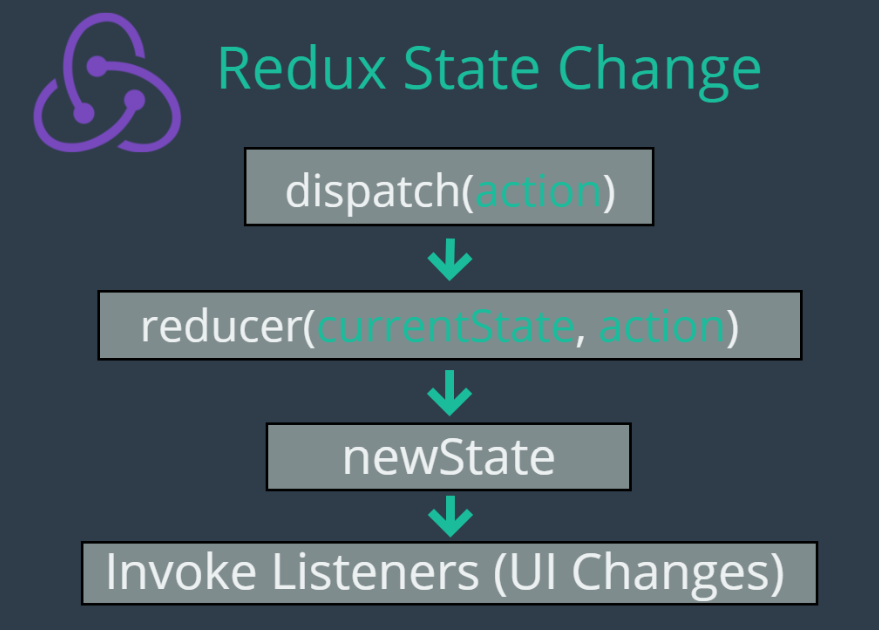

# Redux


[Redux](https://redux.js.org/)

- Libreria que gestiona el estado .
- Modela el estado de la aplicación como un objeto en Js. Lo que significa que toda la data de la aplicación está en un solo lugar

## Redux-installation

```bash

npm install --save redux

```
## Actions

Es un objeto js 100pre debe tener una llave llamada type con un valor del tipo string

Puede tener cualquier cantidad adicional de keys

Representan la intención de cambio accion que quieres hacer en la aplicacion


```jsx
{
    type: "LOGOUT_USER"
}

```

## Reducer 

En esencia decide que nuevo estado regresa dandole el estado anterior y la accion actual 

```jsx
function rootReducer (state = {}, action){
    switch (action.type) {
        case "LOGOUT_USER" :
          return {...state, login: false}
        case "LOGIN_USER" :
          return {...state, login: true}
        default:
         return state;  
    }
}
```

## Store

Es un objeto en js que representa el state de toda la aplicacion. El state de la aplicacion es lo minimo que necesita para funcionar.

Acepta como parametro el reducer principal para toda la aplicacion (main - rootReducer)

El reducer-principal es llamado el rootReducer 

```jsx
const store = Redux.createStore(rootReducer)

```

### Floow

Tenemos una action que es disparada por un cambio en el estado 

Un reducer que decide cual debe ser el cambio de estado cuando se dispara una accion 

Y el store nuestro actual objeto js  key- values pair para el estado de nuestra aplicacion


### Cambiando el estado 

La unica manera de cambiar el estado es llamando el dispatch desde el store.

Si quiere cabiar el estado, tu disparas una action desde el store.


```jsx
const store = Redux.createStore(rootReducer)
store.dispatch({
    type: "LOGIN_USER" //ESTO ES LA ACCION
});

/*
El store al tener como parametro el rootReducer lo que hace es ejecutar esa function y evalua la accion que está en dispatch y retorna el nuevo estado si quieres obtenerlo  */

const newState = store.getState();

/* De esta manera tenemos el nuevo estado de toda la aplicacion 
Notar que redux es sincrono store.dispatch es sincrono, en el momento que store.dispatch se ejecuta y finaliza yu sabes que el estado se actualizo a un nuevo estado.

*/


```


## Escuchando el cambio 

Puedes agregar escuchadores para ver cuando el estado ha cambiado

```jsx
const store = Redux.createStore(rootReducer)
const changeCallback = () => {
    console.log("State has change", store.getState());
}

const unsubscribe = store.listen(changeCallback)

```




